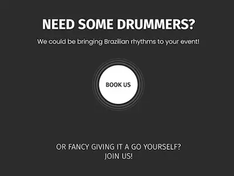
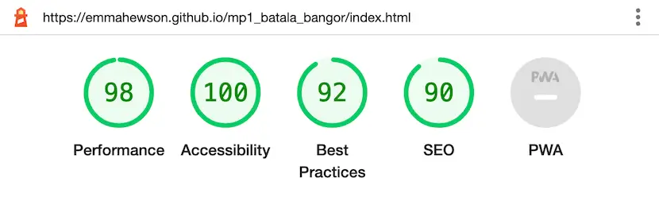
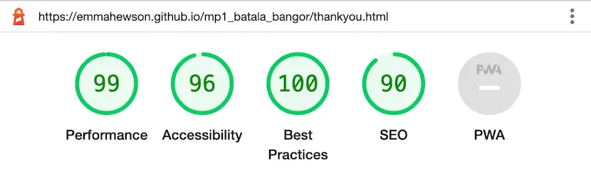
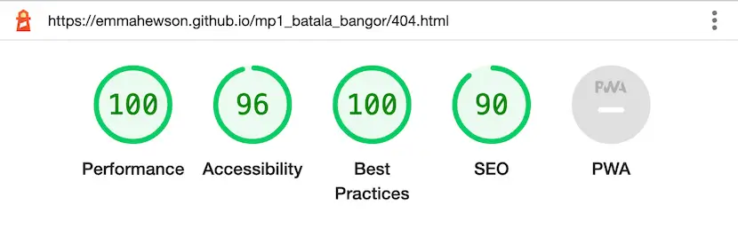

# Batala Bangor Website
#### By Emma Hewson


[Click here to view the live web application](https://emmahewson.github.io/mp1_batala_bangor/index.html)

**BATALA HEY!** This is the documentation for Batala Bangor’s new website. It has been built using HTML5 & CSS3 for educational purposes as part of Code Institute’s Diploma in Web Application Development Course.


## Table of Contents

1. [Project Development & Planning](#project-development--planning)
    * [Project Goals](#project-goals)
        * [Client Background](#client-background)
        * [Client Goals](#client-goals)
        * [User Goals](#user-goals)
    * [Research](#research)
        * [Market Review](#market-review)
        * [Existing Product Audit](#existing-product-audit)
        * [Key Takeaways](#key-takeaways-from-market-review--existing-project-audit)
    * [User Stories](#user-stories)
    * [Design, Layout & Structure](#design-layout--structure)
        * [Wireframes](#wireframes)
        * [Structure](#structure)
        * [Colour](#colour)
        * [Fonts](#fonts)
2. [Technologies Used](#technologies-used)
    * [Languages](#languages)
    * [Tools](#tools)
3. [Features](#features)
    * [Whole Site](#whole-site)
        * [Nav Bar](#whole-site)
        * [Hero Image](#hero-image)
        * [Footer](#footer)
    * [Home Page](#home-page)
        * [Short Bio](#short-bio)
        * [Find Out More Button](#find-out-more-button)
        * [Photo Gallery](#home-photo-gallery)
        * [Video](#video)
    * [About Us](#about-us)
        * [About Us Sections](#about-us-sections)
        * [Call To Action](#call-to-action)
    * [Book Us](#book-us)
        * [Book Us Info](#book-us-info-text)
        * [Booking Enquiry Form](#booking-enquiry-form)
        * [Testimonials](#testimonials)
    * [Join Us](#join-us)
        * [Join Us Info](#join-us-info-text)
        * [Interest in Joining Form](#interest-in-joining-form)
        * [Photo Gallery](#join-photo-gallery)
    * [Other Pages](#other-pages)
        * [Thankyou Page](#thankyou-page)
        * [404 Page](#404-page)
    * [Future Features](#future-features)
* [Testing](#testing)
    * [HTML Validation](#html-validation)
    * [CSS Validation](#css-validation)
    * [Accessibility](#accessibility)
    * [Performance](#performance)
    * [Responsiveness / Device Testing](#responsiveness--device-testing)
    * [Browser Compatibility](#browser-compatibility)
    * [Testing User Stories](#testing-user-stories)
* [Bugs](#bugs)
    TBC!!!!!!!!!!!
* [Deployment](#deployment)
    * [GitHub Pages](#github-pages)
    * [Forking the GitHub Repository](#forking-the-github-repository)
    * [Cloning the GitHub Repository](#cloning-the-github-repository)
* [Credits](#credits)
    * [Code](#code)
    * [Content](#content)
    * [Media](#media)
    * [Acknowledgements](#acknowledgements)

## Project Development & Planning

I followed the principles of User Experience (UX) in the planning and development of my website, including the 5 planes of Strategy, Scope, Structure, Skeleton & Surface. At all times I wanted to make sure that the website was easy to use, responsive, accessible and intuitive as well as meeting the goals and needs of the user and client.


### Project Goals

#### Client Background
Batala Bangor is a samba reggae drumming group based in North Wales. Each summer the band perform at carnivals, fairs, festivals and events across North Wales and beyond. Anyone can join and no experience is required. The music that Batala Bangor plays originates in Salvador, Brazil, and Batala Bangor is one of over 40 Batala bands worldwide who all play the same rhythms and meet up regularly for international events.

#### Client Goals

* For the band to get booked for more / better events
* To have a more professional appearance
* To attract new members
* To share information about our band, our music and the global Batala community

#### User Goals

The website will be for different types of users with different motivations and goals [further details below](#user-stories):
* An event organiser looking to book the band
* Someone interested in joining the band
* Fans of the band interested in learning more about them


### Research

#### Market Review

I conducted a market review which included other bands in North Wales, drumming groups and other Batala bands across the UK (links below). I looked at their websites & social media accounts, how they presented and promoted themselves, what content and features they offered, how it was laid out, what worked and what didn’t.

[Bloco Swn](https://colindaimond.co.uk/) | [Cowbois Celtaidd](https://www.reverbnation.com/cowboisceltaidd) | [Katumba](https://katumba.co.uk/) | [Batala Mersey](https://www.batalamersey.com/) | [Batala Portsmouth](https://www.batalaportsmouth.com/home) | [Batala Bermo](https://www.batalabermo.co.uk/)

#### Existing Product Audit

[Batala Bangor](http://www.batalabangor.com/) has an existing website that is in need of updating. I did a full review of the site, what worked well, what needed updating, what was missing and a general assessment of the content, features, design, layout and style.

#### Key Takeaways from Market Review & Existing Project Audit
* Who, what & where the band is should be immediately obvious
* Keep it clean and simple
* Keep text short and impactful
* Strong hero images relevant to the page content work well to provoke emotion
* Images & video content should be a key feature
* Testimonials & past event logos are useful for creating a strong reputation
* Upcoming & recent gigs listings give a sense of a vibrant, active & in-demand band
* Make sure nav and social media links are accessible and easy to find


### User Stories

**User Story 1: As an event organiser interested in booking the band I want to:**
* find out information about the band
* see & hear media content of the band performing
* see feedback from previous events
* find links to social media for more information and content
* contact the band to find out more & to enquire about booking

**User Story 2: As someone interested in joining the band I want to:**
* find out general information about the band and music
* see & hear media content of the band performing
* find social media links to interact with the band
* find out about opportunities for members
* find out about commitment & experience required to join
* contact the band to express an interest in joining

**User Story 3: As a fan of the band I want to:**
* find out general information about the band and the music
* see & hear the band performing
* find social media link to interact with the band and find out about future events

Based on my earlier research and by defining my user stories I was able to create a clear scope for the website to keep the project on track and to avoid scope creep later on. As this was my first web development project I put a lot of focus in to having a concrete scope from the beginning.


### Design, Layout & Structure

I chose to have a bright, clean, bold design using the Batala colours of red, white and black, with lots of visual content such as large eye-catching images.

#### Wireframes

I decided to create a fully designed site in Figma before moving on to coding. This allowed me to develop the structure, skeleton and layout as well as developing the style and look of the site. As this was my first web development project I wanted to have all major design decisions in place including the colours, fonts, spacing, proportions, which images I would use etc so that I could focus on the coding later on.

<details><summary>Home</summary>

</details>
<details><summary>About Us</summary>

</details>
<details><summary>Book Us</summary>

</details>
<details><summary>Join Us</summary>

</details>

   
#### Structure

The structure of the site is informed by the scope, user and business goals as well as the principles of IXD (interaction design) to make sure I was conforming to user’s expectations and making everything as intuitive as I could.

The site has a simple structure made up of 4 pages:
* Homepage - a short introduction to what the band is, photos and a video
* About Us - more detailed information about the band, the music and the wider Batala Project
* Book Us - information about booking the band and a booking enquiry form
* Join Us - information about joining the band and a form to express interest in joining
* There are also 2 additional sub pages
    * A thank you page for when a user has submitted a form
    * A 404 page for when a user lands on a non-existent page

The site has a navbar which remains fixed to the top of the page on desktop & tablet, (on mobile it uses too much screen real estate and negatively impact on the user experience so it scrolls with the rest of the page) this allows a user to access any page they need at any time and would be suitable for a returning visitor who knows exactly where they want to go. However I have designed a preferred pathway through the site via suggested links which would guide a first time user through the content should they wish to follow it.
The suggested route is: HOME > ABOUT > BOOK/JOIN (with the priority & emphasis given to BOOK at the end as this is a more important goal for the band.)




#### Colour

I chose to use muted versions of the Batala brand colours of black, white and red as using a full primary red and 100% black was quite garish and hard on the eyes. This helped to keep the site bright, friendly and bold.


#### Fonts

I imported [Google Fonts](https://fonts.google.com/) and used [Poppins](https://fonts.google.com/specimen/Poppins) (with a fallback of Sans Serif) for the main body text. I felt this had a friendly, rounded shape that suited the site design, good legibility and a range of weights. I used [Fira Sans](https://fonts.google.com/specimen/Fira+Sans) (with a fallback of Sans Serif) for the headings. I chose it because it had good contrast with the body font and had a strong bold look to have good legibility over images as well as a contrasting thin versions which would make it flexible for different heading types.


## Technologies Used

### Languages
* [HTML](https://en.wikipedia.org/wiki/HTML5)
* [CSS](https://en.wikipedia.org/wiki/Cascading_Style_Sheets)

### Tools
* [Git](https://git-scm.com/)
    * Used for version control via GitPod by using the terminal to Git and Push to GitHub
* [GitHub](https://github.com/)
    * Used to store the project code after being created in GitPod / Git
* [Gitpod](https://www.gitpod.io/)
    * Used to create, edit & preview the project's code
* [Figma](https://www.figma.com/)
    * Used to develop the wireframes in to a full mockup including colours, fonts, proportions etc.
* [Adobe Illustrator](https://www.adobe.com/uk/products/illustrator.html)
    * Used to help create the colour pallette as well as designing some of the graphic elements such as the buttons.
* [Adobe Photoshop](https://www.adobe.com/uk/products/photoshop.html)
    * Used to crop, adjust and resize the photos to optimise them for the site
* [Image Optim](https://imageoptim.com)
    * Used to further optimise the images for the site
* [Bootstrap 5.2.3](https://getbootstrap.com/)
    * Bootstrap was used to help with the responsiveness of the site and to aid the coding of some of the layout, inlcluding the nav bar, the hero images & the photo galleries.
* [Google Fonts](https://fonts.google.com/)
    * Used to select & import the fonts to the project (Poppins & Fira Sans)
* [Font Awesome](https://fontawesome.com/)
    * Used to add icons to the site to help with UX and to add more character


## Features

### Whole Site

#### Nav Bar

#### Hero Image

#### Footer


### Home Page

#### Short Bio

#### Find Out More Button

#### Home Photo Gallery

#### Video


### About Us

#### About Us Sections

#### Call To Action


### Book Us

#### Book Us Info Text

#### Booking Enquiry Form

#### Testimonials


### Join Us

#### Join Us Info Text

#### Interest in Joining Form

#### Join Photo Gallery


### Other Pages

#### Thankyou Page

#### 404 Page


### Future Features
Future Plans
Upcoming gigs are key - including recent events also a good idea
Idea - include links to other Batala bands around the world - interactive map!! (Future plan)
Idea - include call out for videos/photos that people may have taken in gallery


## Testing

### HTML Validation

I ran the code for all the pages through the [W3C HTML Validator](https://validator.w3.org/nu/).
<details><summary>Home</summary>

</details>
<details><summary>About Us</summary>

</details>
<details><summary>Book Us</summary>

</details>
<details><summary>Join Us</summary>

</details>
<details><summary>Thankyou</summary>

</details>
<details><summary>404</summary>

</details>

**Results**
2 of the pages contained errors; Join Us & Book Us. 
They fell under 2 categories
* Using a `<p>` element within a `<button>`
    * I fixed this by changing the `<p>` to a `<span>`
* Using the unit 'px' after the height & width of the testimonial images in the inline styling
    * I fixed this by removing the 'px' units

**HTML Validation - Post Fixes**
<details><summary>Book Us</summary>

</details>
<details><summary>Join Us</summary>

</details>

### CSS Validation

I ran the CSS code through the [W3C CSS Validator](https://jigsaw.w3.org/css-validator/). There were no errors, there were a number of warnings but the validator was simply flagging up that it couldn't check the external Bootstrap stylesheet.
<details><summary>CSS Validation Results</summary>

</details>

### Accessibility

I ran the site through the [Wave Web Accessibility Evaulation Tool](https://wave.webaim.org/). I discovered a number of small issues that required some changes to make the site more accessible.

* The tool raised some contrast errors in the text elements in the footer social links with a class of 'sr-only' (which are hidden by the Bootstrap styling).
I tried a number of ways to fix this error based on my research, via the Code Institute Slack Community and via Code Insitute Tutor Support:
    * Changing the `<span>` for an `aria-label` within the `<i>` element. However this caused an error of an empty link and is not best practice.
    * Over-riding the Bootstrap styling with color and background-color changes. This had no impact on the contrast errors.
But I was unable to come up with a solution, however because the `sr-only` elements are invisible so low contrast wouldn't make any difference to them I didn't think this would have an overall impact on the accessibility of the site.


* The tool raised a number of issues with the ordering of the heading elements, including not starting with an `<h1>` and certain situations where an `<h3>` was before an `<h2>`. In the development process I had used the heading elements more as styling classes than thinking about them in terms of accessibility and content. In order to solve this problem I made multiple changes to the HTML and CSS code, including using classes to style the text, rather than the heading elements themselves, and making sure that they were in the correct order on each page.


* The tool also picked up on a missing label for the `<textarea>` element in the book and join forms. As the textarea contained placeholder text I had not included a label. I solved this problem by adding an aria-label to the `<textarea>` with the same text content as the placeholder.


```
<label for="book-form-textarea" class="sr-only">Anything else we need to know?</label>
<textarea id="book-form-textarea" class="form-input-textarea" name="experience-info" rows="5">Anything else we need to know?</textarea>
```

With these amendment made there were no further significant accessibility issues in the site.

### Performance

I ran the site through Google Chrome Dev Tools' Lighthouse to check on its performance.

**Original Results**
<details><summary>Home</summary>

</details>
<details><summary>About Us</summary>

</details>
<details><summary>Book Us</summary>

</details>
<details><summary>Join Us</summary>

</details>
<details><summary>Thankyou</summary>

</details>
<details><summary>404</summary>

</details>


Whilst the scores were high I was able to make the following improvements based on the results.
* further optimised the images on the site by converting them to webp and resizing where relevant
* adding `height` and `width` attributes to the images to avoid large layout shifts when loading
* added a `<meta>` description to the pages. This raised my SEO score to 100 for all pages
* removed unused font weights from the CSS `@import` code
* increased the contrast in the non-active nav links by increasing the opacity (to make them easier to read)

### Responsiveness / Device Testing

### Browser Compatibility

### Testing User Stories


## Bugs

### Animated button lines on no-hover devices

During development I created 'buttons' which had a hover CSS animation on them where lines animated out from behind the circle (designed to represent drum vibrations.) However I wanted the lines to be visible on devices where there was no hover available (e.g. touchscreen). My solution was to create an additional media query for devices without a hover function that changed the starting values for the scale transform to the final values of the animation.

```
/* No Hover Devices */

@media (hover: none) {

    .line-circle-inner,
    .line-circle-middle,
    .line-circle-outer {
        transform: scale(1)
    }
}
```

### Booking Form - Date Input Styling


During testing on an Apple iPhone SE I discovered that the date input styling wasn't working correctly and the input box didn't match the styling of the others. In order to fix this bug I changed the input type to 'text' as I this would allow the styling to render properly and also give the user more flexibility about what data they enter if, for example, the event ran over multiple days. This solution worked well in this situation but a solution to the cause of the problem would need further investigation should I need to use a date input in the future.

### Booking Form - Broken Logo


After optimising the images by converting them to webp I missed updating the relative path in book-us.html and had the logo failed to load. I fixed this by updating the code with the new file name.


## Deployment

### GitHub Pages

### Forking the GitHub Repository

### Cloning the GitHub Repository


## Credits

### Code

* [Bootstrap 5](https://getbootstrap.com/): Boostrap library used throughout the project for layout and responsiveness using the Bootstrap Grid System.

### Content

* The text in the About Us section of the site has been adapted and expanded from the original [Batala Bangor Website](http://www.batalabangor.com/)

### Media

#### Video
* Batala Mundo at the Notting Hill Carnival 2018: [Robert Werner](https://www.youtube.com/watch?v=l4y8UoNgOng)

#### Photos
* Home Page
    * Header Image: [Batala Bangor](https://www.facebook.com/photo/?fbid=10227121941141799&set=a.10200410283327048)
    * Photo Gallery
        * Photo 1: [Batala Bangor](https://www.facebook.com/photo/?fbid=10216346334398365&set=a.10200410283327048)
        * Photo 2: [Iolo Penri](https://www.gwyl-ogwen.org/gallery/gallery-2021/)
        * Photo 3: [Batala Bangor](https://www.facebook.com/photo/?fbid=10227184998558195&set=a.10200410283327048)
        * Photo 4: [Batala Bangor](https://www.facebook.com/photo/?fbid=10213203101139498&set=a.10200410283327048)
        * Photo 5: [Batala Bangor](https://www.facebook.com/batala.bangor)
        * Photo 6: [Batala Bangor](https://www.facebook.com/photo?fbid=10227387537861551&set=a.10200410283327048)
* About Us
    * Header Image: [Batala Bangor](https://www.facebook.com/photo/?fbid=10215920009340505&set=a.10200410283327048)
    * The Band: [Rhyl Journal](https://www.rhyljournal.co.uk/news/17786708.carnival-fever-takes-prestatyn/)
    * The Music: [Batala Buenos Aires](https://www.facebook.com/photo?fbid=954696041322462&set=bc.AbofSEqe-MAgNWmjkkF2-lC1-xR3CAvaEqH99efyE1RVlJcOmW1ONqgpNLoJIDP2XcmQ6elhwCeERNtS6AGZJDln3pfw0-kD00Jqbpj7ZS-znbkdTJemVYe-DHWjF4WXH_hHnvVSG98pxh4evPrFpxXl&opaqueCursor=Abo8VXgT5JeBqsXgBF69CjSdP-Sm-JzRHSgQkbsQCnZKmYarCj57crwfzvYt8_55LPNKgp_M5dKJe7MVXa53TKqtWIR0aCNy5cZ_NXT-qihO9ChohCo__4XXmbSD2K9djl6LI47V9QzZ_YbFNhKai3Li1UILlwTyILZJB9HAK93BWEjN9Q6f2LKmBJZ0tIYuTJZZKKjq3Cg8cJxbk7YQyniuh6j4gs-b4RAfa1K9x1aHWm8qELUU0KBYNOG7PmViEBFOl59Hyn-CwMY7fDqOxqMS_W2DmIDMhqiT2ivQ60hAZo90djILaGAVx1pxuWz_0OghrZvRtuDnknhe0u2jFue5uJXmKwbsMXhlmoPnI7kwx4dqM0oR9SIPTGgRlhlgS451P6czEgLwMHz1DR825rec7aABKXT_rsJMKsCuEi0wkoXBVpzGlfLQyIdP5N22Km9tK1dEbMN7ja-UJnaqsslp69LXqM71DedfXqpCC_Jvu0VGrPQlKKoAfG3YiDRrKT8UrN57NvudosDtXJiK0jreyAxaevFyWvq0YGT9lJe6igWwa43rkdCDergMY7UtgUgBcSbYKS0mcsKFVMuwUAtOrwpSjmE8iquzGCN5H4Gl0gOTjPvEd7xO7Za6YUEF0cJ87cC9j9hvCyhvdvqSaaIKXJz1nuU0Ni4wEY_KX3yJr9xB-nkTdB6k1o9VaYCNWDA8vbxUzvH6i_NLw1aKbD8wbHUUMnpSyEM-mobmAirebUDu74f3DlT3_tOd76DKGt0)
    * Batala Mundo: [Robert Werner](https://www.facebook.com/photo/?fbid=10156441689766142&set=a.10150550182556142)
* Book Us
    * Header Image: [Gwyl Fwyd Caernarfon](https://www.facebook.com/gwylfwydcaernarfon/photos/a.5056515664439183/5056488001108616/)
    * Testimonials
        * Photo 1: [Sharon Bell](https://www.facebook.com/photo/?fbid=10216450279001548&set=a.10216510292941859)
        * Photo 2: [S.T. Photography](https://www.facebook.com/photo/?fbid=2338954146317028&set=a.2338953726317070)
        * Photo 3: [Batala Bangor](https://www.facebook.com/photo?fbid=10227867634223660&set=a.10200410283327048)
        * Photo 4: [Batala Bangor](https://www.facebook.com/photo/?fbid=10221281269528659&set=a.10200410283327048)
        * Photo 5: [Mark Pruden](https://www.facebook.com/photo/?fbid=10218380564052835&set=a.10200410283327048)
        * Photo 6: [Maggie Pruden](https://www.facebook.com/photo/?fbid=10159148317046443&set=g.105692496195414)
* Join Us
    * Header Image: [Sharon Bell](https://www.facebook.com/photo.php?fbid=10223986882611928&set=t.705801141&type=3)
    * Photo Gallery
        * Photo 1: [Batala Bangor](https://www.facebook.com/photo/?fbid=10215554678287457&set=a.10200410283327048)
        * Photo 2: [Emma Hewson](https://www.facebook.com/photo/?fbid=10156439308791142&set=bc.AbrWsyxwidEb6xThtnnEkhDKbG0bU3ABxKluv4rxxTo5JMCA9433mANWN-OwKraSz_P8l6rR6EaUJQs3nK_qwFLLHC2Yo9kg3d862GxcgTISJ4LqaupXHYB_UO7N43bJm4A&opaqueCursor=AbrmKgYBYg1LtSHaMXVHT28WkaOIVDKa59W4UTWaK0NqV0V0OpwULiJA-Sv0o_-AnppPX0w2YMHOGlOkDbTyj9rdCdDb5ZNgb334Hw9GZ0Yq-nhBitRlwToIGluzgc-x_wiiP37f0Xmku4L-hQ1EbdIjd9jzwmaP0bvpudwNjtFm9nyeWaMakchbpLBVokhGRvPxah8GoULbqwoboMVF8CNr2gIYjtJQmAZGOox8QhuDQhfVQizp16YNt_W1uxMEZGEt-KE8E8jRG_0jEtyzTA_c-Y-gTKfBHBRe_M5ft6yC2hdrRHQbIkPAG39kF0Oq5N4fM0-AVpLKC6qXvjWWGl2UBD2WF6jRErePVQ4i9siMhA6hggGyRdyM57ewVIQ13ySMidgijfUuN-xoaa4Zdl4ILZBhMtsYvP7-K9PtFzE1Vq-XVo42PvKJBIzcgIdNpJmrJIgVSQjDoLDN2QIjJZ3Sz0kafFkeaKN13108hN6JIGGj7azwpupjzRlHDalHIyF0r1I2kWRJJWH13elwv1a9SDPo8e4WYGqAMfoGWw_dAdtAKwLPe3WpwRmb8GyGswrfHY6xS0t9dRAfrePGZVZhWa7CxtuZFm_75IFc3I_DuUs7soFHdcDBgRcMofyLpn5f0mE0wFsfmmawlT4Fju0T_lT84sVkzWTzUDQ5A1Z_adZXKqk-7agz-gIhbdaC-AWD5E7A7mjrC7l5bBvBx5v7P68bnqq3NCWbVH2nlOh_6f3iPtG9mzdZ6U4IaF71zpk)
        * Photo 3: [Batala Bangor](https://www.facebook.com/photo/?fbid=10216346293437341&set=a.10200410283327048)
        * Photo 4: [Iolo Penri](https://www.facebook.com/photo/?fbid=10158649315033378&set=a.10158649301513378)
        * Photo 5: [Mark Pruden](https://www.facebook.com/photo/?fbid=10218815836934385&set=a.10200410283327048)
        * Photo 6: [Batala Bangor](https://www.facebook.com/photo?fbid=10159978367278674&set=a.10151046941808674)
        * Photo 7: [Iolo Penri](https://www.facebook.com/photo/?fbid=10158649312293378&set=a.10158649301513378)
        * Photo 8: [Batala San Pancho](https://www.facebook.com/BatalaSnPancho/)
        * Photo 9: [John Durham / Batala Lancaster](https://www.facebook.com/photo/?fbid=7614883841886652&set=pcb.7614902588551444)
        * Photo 10: [Batala Bangor](https://www.facebook.com/photo/?fbid=10225532609129492&set=a.10200410283327048)
        * Photo 11: [Phil Hen](https://www.facebook.com/photo/?fbid=3416176311947516&set=a.3416177198614094)
        * Photo 12: [Batala Bangor](https://www.facebook.com/photo/?fbid=10225493652875610&set=a.10200410283327048)


### Acknowledgements

* My mentor [Gareth McGirr](https://github.com/Gareth-McGirr/) for all his help and advice throughout the project
* To [Batala Bangor](http://www.batalabangor.com/) for allowing me to use the band as the subject for my project
* The whole team at [Code Institute](https://codeinstitute.net/) for their teaching and support
