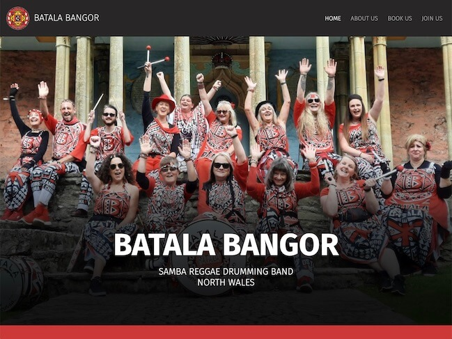
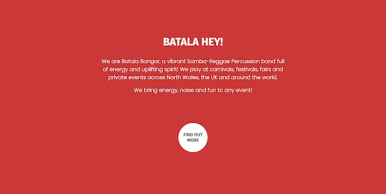
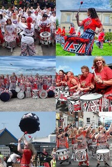
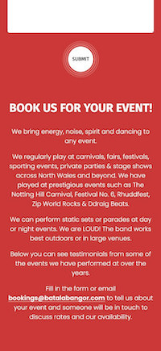
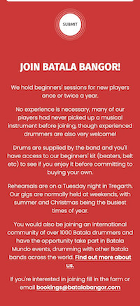
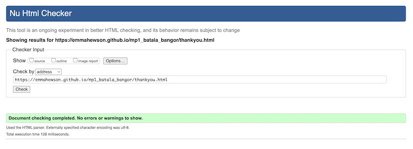
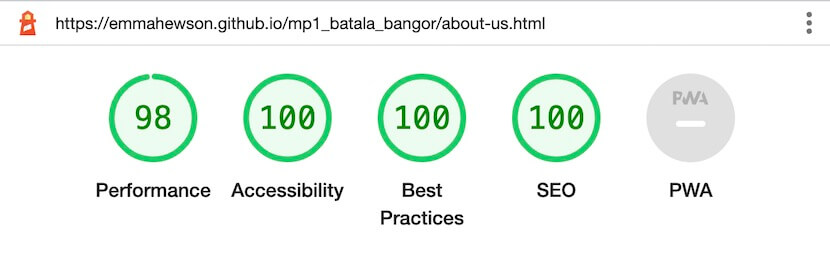
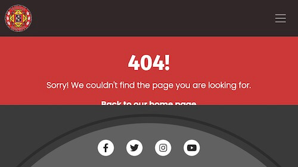
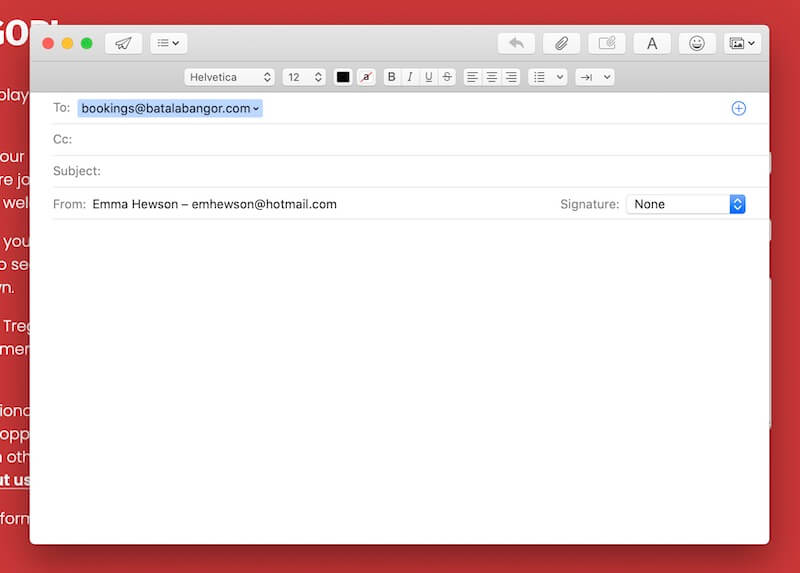

# Batala Bangor Website

#### **By Emma Hewson**
[Click here to view the live web application](https://emmahewson.github.io/mp1_batala_bangor/index.html)

#### **BATALA HEY!**

This is the documentation for Batala Bangor’s new website. It has been built using HTML5 & CSS3 for educational purposes as part of Code Institute’s Diploma in Web Application Development Course.

## Table of Contents

1. [Project Development & Planning](#project-development--planning)
    * [Project Goals](#project-goals)
        * [Project Purpose](#project-purpose)
        * [Client Background](#client-background)
        * [Client Goals](#client-goals)
        * [User Goals](#user-goals)
    * [Research](#research)
        * [Market Review](#market-review)
        * [Existing Product Audit](#existing-product-audit)
        * [Key Takeaways](#key-takeaways-from-market-review--existing-project-audit)
    * [User Stories](#user-stories)
    * [Design, Layout & Structure](#design-layout--structure)
        * [Wireframes](#wireframes)
        * [Structure](#structure)
        * [Colour](#colour)
        * [Fonts](#fonts)
2. [Technologies Used](#technologies-used)
    * [Languages](#languages)
    * [Tools](#tools)
3. [Features](#features)
    * [Whole Site](#whole-site)
        * [Nav Bar](#whole-site)
        * [Hero Image](#hero)
        * [Footer](#footer)
        * [Favicon](#favicon)
    * [Home Page](#home-page)
        * [Bio & Find Out More Button](#bio--find-out-more-button)
        * [Photo Gallery](#home-photo-gallery)
        * [Video](#video)
    * [About Us](#about-us)
        * [About Us Sections](#about-us-sections)
        * [Call To Action](#call-to-action)
    * [Book Us](#book-us)
        * [Book Us Info & Form](#book-us-info--form)
        * [Testimonials](#testimonials)
    * [Join Us](#join-us)
        * [Join Us Info & Form](#join-us-info--form)
        * [Photo Gallery](#join-photo-gallery)
    * [Other Pages](#other-pages)
        * [Thankyou Page](#thankyou-page)
        * [404 Page](#404-page)
    * [Future Features](#future-features)
* [Testing](#testing--bugs)
    * [HTML Validation](#html-validation)
    * [CSS Validation](#css-validation)
    * [Accessibility](#accessibility)
    * [Performance](#performance)
    * [Responsiveness / Device Testing](#responsiveness--device-testing)
    * [Browser Compatibility](#browser-compatibility)
    * [Bugs & Fixes](#bugs--fixes)
    * [Testing User Stories](#testing-user-stories)
* [Deployment](#deployment)
* [Credits](#credits)

## Project Development & Planning

I followed the principles of User Experience (UX) in the planning and development of my website, including the 5 planes of Strategy, Scope, Structure, Skeleton & Surface. At all times I wanted to make sure that the website was easy to use, responsive, accessible and intuitive as well as meeting the goals and needs of the user and client.

### Project Goals

#### **Project Purpose**

Batala Bangor, a North Wales based drumming group, are looking for an updated and redesigned website to promote and share information about the band.

#### **Client Background**
Batala Bangor is a samba reggae drumming group based in North Wales. Each summer the band perform at carnivals, fairs, festivals and events across North Wales and beyond. Anyone can join and no experience is required. The music that Batala Bangor plays originates in Salvador, Brazil, and Batala Bangor is one of over 40 Batala bands worldwide who all play the same rhythms and meet up regularly for international events.

#### **Client Goals**

* For the band to get booked for more / better events (Primary Goal)
* To have a more professional appearance
* To attract new members
* To share information about the band, music and the global Batala community

#### **User Goals**

The website will be for different types of users with different motivations and goals. [Further details below](#user-stories):
* An event organiser looking to book the band
* Someone interested in joining the band
* A fan of the band

### Research

#### **Market Review**

I conducted a market review which included other bands in North Wales, drumming groups and other Batala bands across the UK (links below). I looked at their websites & social media accounts, how they presented and promoted themselves, what content and features they offered, how it was laid out, what worked and what didn’t.

[Bloco Swn](https://colindaimond.co.uk/) | [Cowbois Celtaidd](https://www.reverbnation.com/cowboisceltaidd) | [Katumba](https://katumba.co.uk/) | [Batala Mersey](https://www.batalamersey.com/) | [Batala Portsmouth](https://www.batalaportsmouth.com/home) | [Batala Bermo](https://www.batalabermo.co.uk/)

#### **Existing Product Audit**

[Batala Bangor](http://www.batalabangor.com/) has an existing website that is in need of updating. I did a full review of the site, what worked well, what needed updating, what was missing and a general assessment of the content, features, design, layout and style.

#### **Key Takeaways from Market Review & Existing Project Audit**
* Who, what & where the band is should be immediately obvious
* Keep it clean and simple
* Keep text short and impactful
* Strong hero images relevant to the page content work well to provoke emotion
* Images & video content should be a key feature
* Testimonials & past event logos are useful for creating a strong reputation
* Upcoming & recent gigs listings give a sense of a vibrant, active & in-demand band
* Make sure nav and social media links are accessible and easy to find

### User Stories

#### **User Story 1: As an event organiser interested in booking the band I want to:**
* find out information about the band
* see & hear media content of the band performing
* see feedback from previous events
* find links to social media for more information and content
* contact the band to find out more & to enquire about booking

#### **User Story 2: As someone interested in joining the band I want to:**
* find out general information about the band and music
* see & hear media content of the band performing
* find social media links to interact with the band
* find out about commitment & experience required to join and opportunities for members
* contact the band to express an interest in joining

#### **User Story 3: As a fan of the band I want to:**
* find out general information about the band and the music
* see & hear the band performing
* find social media link to interact with the band and find out about future events

Based on my earlier research and by defining my user stories I was able to create a clear scope for the website to keep the project on track and to avoid scope creep later on. As this was my first web development project I put a lot of focus in to having a concrete scope from the beginning.

### Design, Layout & Structure

I chose to have a bright, clean, bold design using the Batala colours of red, white and black, with lots of visual content such as large eye-catching images.

#### **Wireframes**

Home

About Us

Book Us

Join Us

I decided to create a fully designed site in [Figma](https://www.figma.com/) before moving on to coding. This allowed me to develop the structure, skeleton and layout as well as developing the style and look of the site. As this was my first web development project I wanted to have all major creative design decisions in place including the colours, fonts, spacing, proportions, which images I would use etc so that I could focus on the technical coding later on.
   
#### **Structure**

The structure of the site is informed by the scope, user and business goals as well as the principles of IXD (interaction design) to make sure I was conforming to user’s expectations and making everything as intuitive as I could.

The site has a simple structure made up of 4 pages:
* Homepage - a short introduction to what the band is, photos and a video
* About Us - more detailed information about the band, the music and the wider Batala Project
* Book Us - information about booking the band and a booking enquiry form
* Join Us - information about joining the band and a form to express interest in joining
* There are also 2 additional sub pages
    * A thank you page for when a user has submitted a form
    * A 404 page for when a user lands on a non-existent page

The site has a navbar which remains fixed to the top of the page on desktop & tablet, (on mobile it uses too much screen real estate and negatively impact on the user experience so it scrolls with the rest of the page) this allows a user to access any page they need at any time and would be suitable for a returning visitor who knows exactly where they want to go. There is also a footer on every page with links to the band's social media sites.

There is also another method of navigation, a preferred pathway through the site via suggested links which would guide a first time user through the content. This is designed primarily for people who want to book the band (as this is the primary goal for the client) but with a secondary option for people who want to join.

The suggested route is: HOME > ABOUT > BOOK/JOIN

Screenshots

*Buttons that the user would use to navigate through the site on this route*

#### **Colour**

I chose to use muted versions of the Batala brand colours of black, white and red as using a full primary red and 100% black was quite garish and hard on the eyes. This helped to keep the site bright, friendly and bold.

#### **Fonts**

I imported [Google Fonts](https://fonts.google.com/) and used [Poppins](https://fonts.google.com/specimen/Poppins) (with a fallback of Sans Serif) for the main body text. I felt this had a friendly, rounded shape that suited the site design, good legibility and a range of weights. I used [Fira Sans](https://fonts.google.com/specimen/Fira+Sans) (with a fallback of Sans Serif) for the headings. I chose it because it had good contrast with the body font and had a strong bold look to have good legibility over images as well as a contrasting thin versions which would make it flexible for different heading types.

## Technologies Used

### Languages
* [HTML](https://en.wikipedia.org/wiki/HTML5)
* [CSS](https://en.wikipedia.org/wiki/Cascading_Style_Sheets)

### Tools
* [Git](https://git-scm.com/)
    * Used for version control via GitPod by using the terminal to Git and Push to GitHub
* [GitHub](https://github.com/)
    * Used to store the project code after being created in GitPod / Git
* [Gitpod](https://www.gitpod.io/)
    * Used to create, edit & preview the project's code
* [Figma](https://www.figma.com/)
    * Used to develop the wireframes in to a full mockup including colours, fonts, proportions etc
* [Bootstrap 5.2.3](https://getbootstrap.com/)
    * Used to help with the responsiveness of the site and to aid the coding of some of the layout, inlcluding the nav bar, the hero images & the photo galleries
* [Google Fonts](https://fonts.google.com/)
    * Used to select & import the fonts to the project (Poppins & Fira Sans)
* [Font Awesome](https://fontawesome.com/)
    * Used to add icons to the site to help with UX and to add more character
* [Adobe Illustrator](https://www.adobe.com/uk/products/illustrator.html)
    * Used to help create the colour pallette as well as designing some of the graphic elements such as the buttons
* [Adobe Photoshop](https://www.adobe.com/uk/products/photoshop.html)
    * Used to crop, adjust and resize the photos to optimise them for the site
* [Tiny PNG](https://tinypng.com/)
    * Used to further optimise the images for the site and reduce file size
* [Favicon.io](https://favicon.io/favicon-converter/)
    * Used to create and add the favicon to the browser tab

## Features

### Whole Site

#### **Nav Bar**

Screenshots

*Navbar - desktop*

*Navbar - hover effect*

*Navbar - mobile*

* Appears on all pages
* Contains the logo, the name of the band (on larger screens) and nav links to all the main pages
* The navbar is fully responsive
* On larger devices the navbar stays fixed at the top of the screen as the user scrolls
* The page that the user is currently on is highlighted
* There is a hover effect on the other nav links

#### **Hero**

Screenshots

*Hero - Home on Desktop*

*Hero - About Us on Desktop*

*Hero - Book Us on Desktop*

*Hero - Join Us on Desktop*

*Hero - Home on Mobile*

* Each main page features a hero image with the title of the page as a text header.
* The home page has a large hero image designed to take up a large proportion of the viewing window, so that the first thing the user sees is a strong, large image of the band. The size of this has been designed to leave a small part of the next container visible as a hint to encourage the user to scroll down.
    * On smaller screen sizes this size is reduced to work better with the aspect ratio of the photo and to provide a better user experience
* The images have a gradient over them to improve the legibility of the text.
* This hero is responsive, with the text, layout and gradient changing on different size screens in portrait and landscape, for legibility and aesthetic purposes.
* The JOIN, BOOK and ABOUT pages have a smaller hero image container to give more space to other more important features on these pages.

#### **Footer**

Screenshots

*Footer on Desktop*

*Footer Social Links Animation*

*Footer on mobile*

* The footer appears on all pages
    * The only exception is on certain small landscape screen sizes on the 404 and thankyou pages due to a bug fix. [Read more here](#thankyou404-page-responsiveness)
* The footer has a unique design of a partial circle and an outer stroke. This is a bespoke design that I created for the brand and is repeated in the button design.
* The footer contains links to social media pages, all of which open in a separate tab.
* The social links change to the soft red colour used across the site when the user hovers over them. The animation on these has an ease-in-out to make the colour transition smoothly.
* The footer is designed to work on any screen size down to the smallest mobile screens.

#### **Favicon**

Screenshots

*Favicon*

* The favicon is a feature I added to display the Batala Bangor logo in the top tab of the site. This helps to build the brand and to make the site easier to pick out from other tabs for the user.

### Home Page

#### **Bio & Find Out More Button**

Screenshots

*Bio Section and button*

*Button animation*

* The first section that the user arrives after the hero is a large, bright red container with a brief bio of the band.
* This will give the user an immediate understanding of who the band is and what they do.
* There is also an animated button to encourage the user to find out more about the band (link to About Us)
    * This button has CSS animation on hover devices. The lines represent the vibrations coming off a drum. The text on the button also has a slight scale transform to make the hover effect more impactful.
    * The animation is smooth, with an ease-in-out and staggered timing so the lines appear with a slight offset to give a ripple effect.
    * The animation is disabled on non-hover devices, so the lines are permenantly visible.
* This button gives the user another navigation route through the site, an alternative to navigating using the navbar.

#### **Home Photo Gallery**

Screenshots

*Home Photo Gallery - Desktop*

*Home Photo Gallery - Tablet*

*Home Photo Gallery - Mobile*

* A fully responsive photo gallery containing square images.
* This will give the user lots of strong visuals of the band playing to help build a sense of who they are and what they do.
* The gallery adapts to different screen sizes with the images re-sizing to fill the space and wrapping on to new rows on smaller screens.

#### **Video**

Screenshots

*Embedded YouTube Player*

* An embedded YouTube video player featuring Batala Bangor playing as part of the Notting Hill Carnival with Batala Mundo.
* The player is designed not to autoplay so the user is not surprised by sudden video or audio.
* The player has bespoke, responsive sizing which adjusts on different screen sizes.
* The player has built in features such as play controls, a full screen button and volume control to give the user full control of the video.

### About Us

#### **About Us Sections**

Screenshots

*About Us - Info & Image Section 1 - Desktop*

*About Us - Info & Image Section 2 - Desktop*

*About Us - Info & Image Section 3 - Desktop*

*About Us - Layout on Tablet*

*About Us - Layout on Mobile*

* 3 sections containing text and a strong image with information about different aspects of the band.
* The sections are fully responsive and stack vertically with styling and layout changes on smaller screens.
* The images have a rounded corners to continue the circular design style used elsewhere on the site.

#### **Call To Action**

Screenshots

*Call to Action Section - Links to "Book Us" & "Join Us"*

* Underneath the About Us sections the user is encouraged to click on a "BOOK US" button to link to the relevant section of the site.
    * The button has the same styling & animation as the "FIND OUT MORE" button
* There is also a smaller link to the "JOIN US" page. This allows users who are interested in joining rather than booking to easily find what they are looking for.

### Book Us

#### **Book Us Info & Form**

Screenshots

*Book Us Info & Form - Desktop*

*Submit Button Animation*

*Book Us Form & Info Layout - Tablet*

*Book Us Form & Info Layout - Mobile*

* Text information and a booking form to enquire about booking the band
* On desktop these sit side by side but on smaller screens they stack.
    * The form appears at the top of the stack so that users can immediately see what they have to do and won't miss the form if they fail to scroll down.
    * There are also some layout changes to make the order change and headings make sense on smaller screens
* The submit button has the same styling and animation as the other buttons
* All form elements are required and must be filled in
* The submit button leads the user to a "thankyou" page which reassures them that their form has been sent and offers a route back to the main site.
* The info text also offers the option of emailing the band instead, the email address contains a link to open an email with the address already in place.

#### **Testimonials**

Screenshots

*Testimonials - Desktop*

*Testimonials - Tablet*

*Testimonials - Mobile*

* A series of quotes from previous events giving positive feedback about the band with small circular thumbnail images to make the text a bit more compelling and eye-catching.
* This builds trust to encourage users to book the band.
* This section is responsive, stacking in to a single column on smaller screens.

### Join Us

#### **Join Us Info & Form**

Screenshots

*Join Us Info & Form - Desktop*

*Join Us Form & Info Layout - Tablet*

*Join Us Form & Info Layout - Mobile*

* Text information and an expression of interest form to enquire about joining the band
* On desktop these sit side by side but on smaller screens they stack.
    * The form appears at the top of the stack so that users can immediately see what they have to do and won't miss the form if they fail to scroll down.
    * There are also some layout changes to make the order change and headings make sense on smaller screens
* The submit button has the same styling and animation as the other buttons
* All form elements are required and must be filled in
* The submit button leads the user to a "thankyou" page which reassures them that their form has been sent and offers a route back to the main site.
* The info text also offers the option of emailing the band instead, the email address contains a link to open an email with the address already in place.

#### **Join Photo Gallery**

Screenshots

*Join Us Photo Gallery - Desktop*

*Join Us Photo Gallery - Tablet*

*Join Us Photo Gallery - Mobile*

* A fully responsive photo gallery containing square images.
* This will give someone an idea of who is in the band & the types of events that they play at. Seeing smiling people will hopefully encourage them to join.
* The gallery adapts to different screen sizes with the images re-sizing to fill the space and wrapping on to new rows on smaller screens.

### Other Pages

#### **Thankyou Page**

Screenshots

*Form Submission - Thankyou Page*

* A simple page that appears when a user submits a form
* Improves user experience - reassures the user that the form has sent correctly
* Contains all nav links to other pages as well as a text link to the homepage to allow the user to move on.
* The footer disappears on smaller landscape devices to allow the homepage link to appear [more info](#thankyou404-page-responsiveness)

#### **404 Page**

Screenshots

*Form Submission - Thankyou Page*

* A simple page that appears when a user ends up on a page that doesn't exist
* Improves user experience - by having a branded 404 page a user is less annoyed by something going wrong, the site looks more professional and it will hopefully provide a more positive emotional response than a generic 404 page that makes the user feel they have moved completely off the Batala Bangor site.
* Contains all nav links to other pages as well as a text link to the homepage to allow the user to move on.
* The footer disappears on smaller landscape devices to allow the homepage link to appear [more info](#thankyou404-page-responsiveness)

### Future Features

There are some additional features that I would like to add to the site in the future. They fell outside the scope of this project based on the top priority client and user needs but they would be useful additions later on.

#### **Gig Listings**
A page with an up to date gigs list for people to keep track of where the band will be playing.

#### **Batala Mundo Map**
An interactive map of the world showing locations of all the Batala bands around the world with clickable links to each band's website.

## Testing & Bugs

### HTML Validation

I ran the code for all the pages through the [W3C HTML Validator](https://validator.w3.org/nu/).

Home

About Us

Book Us

Join Us

Thankyou

404

#### **Results**
2 of the pages contained errors; Join Us & Book Us. 
They fell under 2 categories
* Using a `
` element within a `<button>`
    * I fixed this by changing the `
` to a ``
* Using the unit 'px' after the height & width of the testimonial images in the inline styling
    * I fixed this by removing the 'px' units

#### **HTML Validation After Fixes**

Book Us

Join Us

### CSS Validation

I ran the CSS code through the [W3C CSS Validator](https://jigsaw.w3.org/css-validator/#validate_by_input). There were no errors, there were a number of warnings but the validator was simply flagging up that it couldn't check the external Bootstrap stylesheet.

CSS Validation Results

### Accessibility

I ran the site through the [Wave Web Accessibility Evaulation Tool](https://wave.webaim.org/). The tool raised a few issues, some of which required steps to make the site more accessible:

#### **Contrast Error: sr-only**

Screenshot

    
    

The tool raised some contrast errors in the text elements in the footer social links with a class of 'sr-only' (which are hidden by the Bootstrap styling).

I tried a number of ways to fix this error based on my research, via the Code Institute Slack Community and via Code Insitute Tutor Support:
* Changing the `` for an `aria-label` within the `<i>` element. However this caused an error of an empty link and is not best practice.
* Over-riding the Bootstrap styling with color and background-color changes. This had no impact on the contrast errors.

I was unable to come up with a solution, however because the `sr-only` elements are invisible so low contrast wouldn't make any difference to them I didn't think this would have an overall impact on the accessibility of the site.

#### **Heading Order Error**

Screenshots

    
    
    

The tool raised a number of issues with the ordering of the heading elements, including not starting with an `<h1>` and certain situations where an `<h3>` was before an `<h2>`. In the development process I had used the heading elements more as styling classes than thinking about them in terms of accessibility and content. In order to solve this problem I made multiple changes to the HTML and CSS code, including using classes to style the text, rather than the heading elements themselves, and making sure that they were in the correct order on each page.

#### **Form Label Error**

Screenshot

    
    

The tool also picked up on a missing label for the `<textarea>` element in the book and join forms. As the textarea contained placeholder text I had not included a label. I solved this problem by adding an aria-label to the `<textarea>` with the same text content as the placeholder. (An additional bug also appeared in the `<textarea>` code in my general testing: [detailed here](#booking-form---textarea-text-requires-manual-deletion))

In addition to the above there were also 2 alerts which, following investigation, I felt didn't require any further action or improvements:

#### **Redundant link**

The tool flagged up that there were 2 links next to each other in the nav that went to the same URL (index.html). This was due to the logo and Batala Bangor being a clickable link to the homepage as well as the "HOME" nav link, as I wanted the navigation to be as intuitive as possible for the user, giving them 2 options to get home. This would also follow the normal conventions of the web where people expect a logo to be clickable and to go back to the home page. Based on this I felt no further action was required.

#### **YouTube Video Subtitles**

The tool also put out a general alert for the YouTube video to advise that all videos should offer syncronised captioning. As the video doesn't contain any speaking, only drumming, I decided that no further action was required here.

### Performance

I ran the site through Google Chrome Dev Tools' Lighthouse to check on its performance.

#### **Original Results**

Home

About Us

Book Us

Join Us

Thankyou

404

Whilst the scores were high I wanted to make the following improvements based on the results and suggestions to make sure that the site performed as well as it could
* further optimised the images on the site by converting them to webp and resizing where relevant
* adding `height` and `width` attributes to the images to avoid large layout shifts when loading
* added a `<meta>` description to the pages
* removed unused font weights from the CSS `@import` code
* increased the contrast in the non-active nav links by increasing the opacity (to make them easier to read)

#### **Final Results**

Home

About Us

Book Us

Join Us

Thankyou

404

### Responsiveness / Device Testing

The site was tested on the following devices
* Apple Macbook Pro 16inch
* LG Ultrafine Display 27inch External Monitor
* Apple iMac 5K 27-inch
* Apple iPhone SE
* Apple iPhone 5S
* Google Chrome Developer Tools - simulator for all different device options as well as using the adjustable sizing options

The website functioned as expected in most cases on these devices, but there were some minor bugs [details of the bugs relating to responsiveness are below.](#bugs--fixes)

### Browser Compatibility

The site was tested on the following browsers
* Google Chrome
* Mozilla Firefox
* Apple Safari

There were no issues on Chrome and Firefox but Safari did throw up a major bug. [More details below of the bug and fix below.](#safari-not-displaying-images)

### Bugs & Fixes

During development and testing, in addition to the improvements described in the validation section above, I encountered the following bugs:

#### **Animated button lines on no-hover devices**

During development I created buttons which had a hover CSS animation on them where lines animated out from behind the circle (designed to represent drum vibrations.) However I wanted the lines to be visible on devices where there was no hover available (e.g. touchscreen). My solution was to create an additional media query for devices without a hover function that changed the starting values for the scale transform to the final values of the animation.

Final Code Snippet

    @media (hover: none) {
        .line-circle-inner,
        .line-circle-middle,
        .line-circle-outer {
            transform: scale(1)
        }
    }

#### **Booking Form - Date Input Styling**

Screenshot

During testing on an Apple iPhone SE I discovered that the date input styling wasn't working correctly and the input box didn't match the styling of the others. In order to fix this bug I changed the input type to 'text' as I this would allow the styling to render properly and also give the user more flexibility about what data they enter if, for example, the event ran over multiple days. This solution worked well in this situation but a solution to the cause of the problem would need further investigation should I need to use a date input in the future.

#### **Booking Form - Submit Button on Mobile**

Screenshot

During testing on an Apple iPhone SE I discovered that the SUBMIT text had disappeared from the button. This was tricky to diagnose as it was only appearing on my mobile device, not on dev tools. I attempted a variety of fixes including changing the z-index. I fixed this issue by giving the SUBMIT button text an explicit colour, as I discovered the text was there but was displaying in white, so it was invisible against the white background.

#### **Broken Logo Image**

Screenshot

After optimising the images by converting them to webp I missed updating the relative path in book-us.html and had the logo failed to load. I fixed this by updating the code with the new file name.

#### **Booking Form - Textarea text requires manual deletion**

Screenshot

During testing I noticed that the text within the `<textarea>` on both forms needed manually deleting before a user could enter their own message. I fixed this by deleting the text between the `<textarea>` tags and adding a `placeholder` attribute with the same content.

#### **Thankyou/404 Page Layout**

Screenshot

During testing I discovered that the thankyou and 404 pages were displaying with an incorrect layout when the window was wider than 1300px (the max-width I had set for the site). This issue appeared to be caused by the unique layout of these pages which were designed not to scroll, this somehow cause the max-width on the body to not apply to the footer. After some experimentation I fixed this issue by targeting the footer on these pages and using the following CSS styling:

    .subpage-footer {
        position: fixed;
        width: 100%;
        max-width: 1300px;
        bottom: 0;
        margin: 0 auto;
    }

#### **Thankyou/404 Page Responsiveness**

Screenshot - before

Screenshot - after

There was also an issue with the 404 & Thankyou pages not displaying all the content on a horizontal small screen device. This was due to these pages being a non-scrolling static page designed to stay fixed on the screen. I fixed this bug by targeting styling changes directly to screens with a max-height value for these pages, this included changing the padding and removing the footer with the social links. This was a compromise that avoided significant styling changes to the footer for a less-used screen size on a page that users won't spend a long time on, that enhances user experience and legibility.

#### **Safari not displaying images**

Screenshot

A major bug I encountered when testing on Safari was that it didn't display webp format images in older versions of Safari. After doing some research in to various solutions to this apparently common problem I decided that it was too significant an issue to ignore as it would create a very poor user experience for users on older Safari browsers. I made the decision to replace all the webp images with optimised jpgs. I re-tested the site with Lighthouse and the performance scores were identical.

Lighthouse Results with JPG Images

Home

About Us

Book Us

Join Us

Thankyou

404

### Testing User Stories

I tested the site based on my user stories:

#### **1. I want to find out information about the band:**

Screen Recording

*Via "FIND OUT MORE" Button*

*Via Nav Bar*

Screenshots

| **Feature** | **Action** | **Expected Result** | **Actual Result** |
|-------------|------------|---------------------|-------------------|
| Short Bio • Find Out More Button • About Us Text | Scroll down on homepage, read short bio, click on 'find out more' button, read more detail on About Us page | Find information about the band | Works as expected |
| Nav Bar - About Us Link • About Us Text | Click on "ABOUT US" on nav, read more detail on About Us page | Find information about the band | Works as expected |

#### **2. I want to see & hear media content of the band performing:**

Screen Recording

Screenshots

| **Feature** | **Action** | **Expected Result** | **Actual Result** |
|-------------|------------|---------------------|-------------------|
| Site-Wide Images • Photo Galleries • Video | Hero images on all pages, scroll down to photo gallery and video on home page. Images on About Us page. Photo Gallery on Join Us page. | Photo and Video content throughout site | Works as expected |

#### **3. I want to see feedback from previous events:**

Screen Recording

Screenshots

| **Feature** | **Action** | **Expected Result** | **Actual Result** |
|-------------|------------|---------------------|-------------------|
| Testimonials| Click on "BOOK US" on nav, scroll down to read testimonials. | User can read feedback from previous events and fans. | Works as expected |

#### **4. I want to find links to social media for more information and to interact with the band:**

Screen Recording

Screenshots

| **Feature** | **Action** | **Expected Result** | **Actual Result** |
|-------------|------------|---------------------|-------------------|
| Social Media Links in Footer | Scroll to the bottom of main pages, click on footer social media links | User can click through to social media with all links opening in a separate tab. | Works as expected |

#### **5. I want to contact the band to enquire about booking:**

Screen Recording

Screenshots

| **Feature** | **Action** | **Expected Result** | **Actual Result** |
|-------------|------------|---------------------|-------------------|
| Booking Form • Booking Information Text | Click on "BOOK US" on nav, fill in form or click on email address link to send email to band. | User has 2 options for contacting the band. Email opens email client with address pre-filled. Form: all form inputs must be filled to submit. Submission leads to 'thankyou' page with links back to main site. | Works as expected |

#### **6. I want to find out about commitment & experience required to join & opportunities for members:**

Screen Recording

Screenshots

| **Feature** | **Action** | **Expected Result** | **Actual Result** |
|-------------|------------|---------------------|-------------------|
| Join Us Text | Click on "JOIN US" on nav, scroll down to read Join Us text, click on "find out more about us" to link to "About Us" page for more general information. | User finds text information about joining the band. | Works as expected |

#### **7. I want to contact the band to express an interest in joining:**

Screen Recording

Screenshots

| **Feature** | **Action** | **Expected Result** | **Actual Result** |
|-------------|------------|---------------------|-------------------|
| Join Us Form • Join Us Contact Email | Click on "JOIN US" on nav, scroll down to Join Us Form, fill in form or click on email address link in text to send email to band. | User has 2 options for contacting the band. Email opens email client with address pre-filled. Form: all form inputs must be filled to submit. Submission leads to 'thankyou' page with links back to main site. | Works as expected |

## Deployment

### GitHub Pages

The site was deployed to GitHub pages. The steps to deploy are as follows: 
1. In the GitHub repository, navigate to the Settings tab 
2. From the left hand menu select 'Pages'
3. From the source select Branch: main
4. Click 'Save'
5. A live link will be displayed when published successfully. 

The live link can be found here -  https://emmahewson.github.io/mp1_batala_bangor/index.html

### Forking the GitHub Repository

You can fork the repository by following these steps:
1. Go to the GitHub repository
1. Click on Fork button in upper right hand corner

### Cloning the GitHub Repository

You can clone the repository to use locally by following these steps:
1. Navigate to the GitHub Repository you want to clone
2. Click on the code drop down button
3. Click on HTTPS
4. Copy the repository link to the clipboard
5. Open your IDE of choice (git must be installed for the next steps)
6. Type git clone copied-git-url into the IDE terminal

The project will now be cloned locally for you to use.

## Credits

### Code

* [Bootstrap 5](https://getbootstrap.com/): Boostrap library used throughout the project for layout and responsiveness using the Bootstrap Grid System.

* [Favicon.io](https://favicon.io/favicon-converter/): Used to create the site Favicon and provided the code in the head of all pages.

### Content

* The text in the About Us section of the site has been adapted and expanded from the original [Batala Bangor Website](http://www.batalabangor.com/)

### Media

#### **Video**
* Batala Mundo at the Notting Hill Carnival 2018: [Robert Werner](https://www.youtube.com/watch?v=l4y8UoNgOng)

#### **Photos**
* Home Page
    * Header Image: [Batala Bangor](https://www.facebook.com/photo/?fbid=10227121941141799&set=a.10200410283327048)
    * Photo Gallery
        * Photo 1: [Batala Bangor](https://www.facebook.com/photo/?fbid=10216346334398365&set=a.10200410283327048)
        * Photo 2: [Iolo Penri](https://www.gwyl-ogwen.org/gallery/gallery-2021/)
        * Photo 3: [Batala Bangor](https://www.facebook.com/photo/?fbid=10227184998558195&set=a.10200410283327048)
        * Photo 4: [Batala Bangor](https://www.facebook.com/photo/?fbid=10213203101139498&set=a.10200410283327048)
        * Photo 5: [Batala Bangor](https://www.facebook.com/batala.bangor)
        * Photo 6: [Batala Bangor](https://www.facebook.com/photo?fbid=10227387537861551&set=a.10200410283327048)
* About Us
    * Header Image: [Batala Bangor](https://www.facebook.com/photo/?fbid=10215920009340505&set=a.10200410283327048)
    * The Band: [Rhyl Journal](https://www.rhyljournal.co.uk/news/17786708.carnival-fever-takes-prestatyn/)
    * The Music: [Batala Buenos Aires](https://www.facebook.com/photo?fbid=954696041322462&set=bc.AbofSEqe-MAgNWmjkkF2-lC1-xR3CAvaEqH99efyE1RVlJcOmW1ONqgpNLoJIDP2XcmQ6elhwCeERNtS6AGZJDln3pfw0-kD00Jqbpj7ZS-znbkdTJemVYe-DHWjF4WXH_hHnvVSG98pxh4evPrFpxXl&opaqueCursor=Abo8VXgT5JeBqsXgBF69CjSdP-Sm-JzRHSgQkbsQCnZKmYarCj57crwfzvYt8_55LPNKgp_M5dKJe7MVXa53TKqtWIR0aCNy5cZ_NXT-qihO9ChohCo__4XXmbSD2K9djl6LI47V9QzZ_YbFNhKai3Li1UILlwTyILZJB9HAK93BWEjN9Q6f2LKmBJZ0tIYuTJZZKKjq3Cg8cJxbk7YQyniuh6j4gs-b4RAfa1K9x1aHWm8qELUU0KBYNOG7PmViEBFOl59Hyn-CwMY7fDqOxqMS_W2DmIDMhqiT2ivQ60hAZo90djILaGAVx1pxuWz_0OghrZvRtuDnknhe0u2jFue5uJXmKwbsMXhlmoPnI7kwx4dqM0oR9SIPTGgRlhlgS451P6czEgLwMHz1DR825rec7aABKXT_rsJMKsCuEi0wkoXBVpzGlfLQyIdP5N22Km9tK1dEbMN7ja-UJnaqsslp69LXqM71DedfXqpCC_Jvu0VGrPQlKKoAfG3YiDRrKT8UrN57NvudosDtXJiK0jreyAxaevFyWvq0YGT9lJe6igWwa43rkdCDergMY7UtgUgBcSbYKS0mcsKFVMuwUAtOrwpSjmE8iquzGCN5H4Gl0gOTjPvEd7xO7Za6YUEF0cJ87cC9j9hvCyhvdvqSaaIKXJz1nuU0Ni4wEY_KX3yJr9xB-nkTdB6k1o9VaYCNWDA8vbxUzvH6i_NLw1aKbD8wbHUUMnpSyEM-mobmAirebUDu74f3DlT3_tOd76DKGt0)
    * Batala Mundo: [Robert Werner](https://www.facebook.com/photo/?fbid=10156441689766142&set=a.10150550182556142)
* Book Us
    * Header Image: [Gwyl Fwyd Caernarfon](https://www.facebook.com/gwylfwydcaernarfon/photos/a.5056515664439183/5056488001108616/)
    * Testimonials
        * Photo 1: [Sharon Bell](https://www.facebook.com/photo/?fbid=10216450279001548&set=a.10216510292941859)
        * Photo 2: [S.T. Photography](https://www.facebook.com/photo/?fbid=2338954146317028&set=a.2338953726317070)
        * Photo 3: [Batala Bangor](https://www.facebook.com/photo?fbid=10227867634223660&set=a.10200410283327048)
        * Photo 4: [Batala Bangor](https://www.facebook.com/photo/?fbid=10221281269528659&set=a.10200410283327048)
        * Photo 5: [Mark Pruden](https://www.facebook.com/photo/?fbid=10218380564052835&set=a.10200410283327048)
        * Photo 6: [Maggie Pruden](https://www.facebook.com/photo/?fbid=10159148317046443&set=g.105692496195414)
* Join Us
    * Header Image: [Sharon Bell](https://www.facebook.com/photo.php?fbid=10223986882611928&set=t.705801141&type=3)
    * Photo Gallery
        * Photo 1: [Batala Bangor](https://www.facebook.com/photo/?fbid=10215554678287457&set=a.10200410283327048)
        * Photo 2: [Emma Hewson](https://www.facebook.com/photo/?fbid=10156439308791142&set=bc.AbrWsyxwidEb6xThtnnEkhDKbG0bU3ABxKluv4rxxTo5JMCA9433mANWN-OwKraSz_P8l6rR6EaUJQs3nK_qwFLLHC2Yo9kg3d862GxcgTISJ4LqaupXHYB_UO7N43bJm4A&opaqueCursor=AbrmKgYBYg1LtSHaMXVHT28WkaOIVDKa59W4UTWaK0NqV0V0OpwULiJA-Sv0o_-AnppPX0w2YMHOGlOkDbTyj9rdCdDb5ZNgb334Hw9GZ0Yq-nhBitRlwToIGluzgc-x_wiiP37f0Xmku4L-hQ1EbdIjd9jzwmaP0bvpudwNjtFm9nyeWaMakchbpLBVokhGRvPxah8GoULbqwoboMVF8CNr2gIYjtJQmAZGOox8QhuDQhfVQizp16YNt_W1uxMEZGEt-KE8E8jRG_0jEtyzTA_c-Y-gTKfBHBRe_M5ft6yC2hdrRHQbIkPAG39kF0Oq5N4fM0-AVpLKC6qXvjWWGl2UBD2WF6jRErePVQ4i9siMhA6hggGyRdyM57ewVIQ13ySMidgijfUuN-xoaa4Zdl4ILZBhMtsYvP7-K9PtFzE1Vq-XVo42PvKJBIzcgIdNpJmrJIgVSQjDoLDN2QIjJZ3Sz0kafFkeaKN13108hN6JIGGj7azwpupjzRlHDalHIyF0r1I2kWRJJWH13elwv1a9SDPo8e4WYGqAMfoGWw_dAdtAKwLPe3WpwRmb8GyGswrfHY6xS0t9dRAfrePGZVZhWa7CxtuZFm_75IFc3I_DuUs7soFHdcDBgRcMofyLpn5f0mE0wFsfmmawlT4Fju0T_lT84sVkzWTzUDQ5A1Z_adZXKqk-7agz-gIhbdaC-AWD5E7A7mjrC7l5bBvBx5v7P68bnqq3NCWbVH2nlOh_6f3iPtG9mzdZ6U4IaF71zpk)
        * Photo 3: [Batala Bangor](https://www.facebook.com/photo/?fbid=10216346293437341&set=a.10200410283327048)
        * Photo 4: [Iolo Penri](https://www.facebook.com/photo/?fbid=10158649315033378&set=a.10158649301513378)
        * Photo 5: [Mark Pruden](https://www.facebook.com/photo/?fbid=10218815836934385&set=a.10200410283327048)
        * Photo 6: [Batala Bangor](https://www.facebook.com/photo?fbid=10159978367278674&set=a.10151046941808674)
        * Photo 7: [Iolo Penri](https://www.facebook.com/photo/?fbid=10158649312293378&set=a.10158649301513378)
        * Photo 8: [Batala San Pancho](https://www.facebook.com/BatalaSnPancho/)
        * Photo 9: [John Durham / Batala Lancaster](https://www.facebook.com/photo/?fbid=7614883841886652&set=pcb.7614902588551444)
        * Photo 10: [Batala Bangor](https://www.facebook.com/photo/?fbid=10225532609129492&set=a.10200410283327048)
        * Photo 11: [Phil Hen](https://www.facebook.com/photo/?fbid=3416176311947516&set=a.3416177198614094)
        * Photo 12: [Batala Bangor](https://www.facebook.com/photo/?fbid=10225493652875610&set=a.10200410283327048)

### Acknowledgements

* My mentor [Gareth McGirr](https://github.com/Gareth-McGirr/) for all his help and advice throughout the project
* To [Batala Bangor](http://www.batalabangor.com/) for allowing me to use the band as the subject for my project
* The whole team at [Code Institute](https://codeinstitute.net/) for their teaching and support
